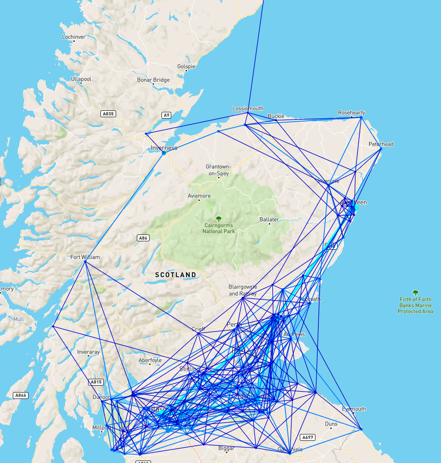

# Population Mesh

Tool for visualising population centres and connectivity.

Creates population meshes based on proximity to other population centres.

See *Gareth Dennis - Rail Natter #65* for more details
https://www.youtube.com/watch?v=y2v846_jqwc&ab_channel=GarethDennis



## Installing

1. `yarn`
2. You need to patch a file from react-mapbox-gl to make production builds work

    ```
    --- a/node_modules/react-mapbox-gl/lib-esm/map.js
    +++ b/node_modules/react-mapbox-gl/lib-esm/map.js
    @@ -22,7 +22,7 @@
                };
            return __assign.apply(this, arguments);
        };
    -   import * as MapboxGl from 'mapbox-gl';
    +   import * as MapboxGl from '!mapbox-gl';
        import * as React from 'react';
        import { listenEvents, events, updateEvents } from './map-events';
        import { MapContext } from './context';
    ```